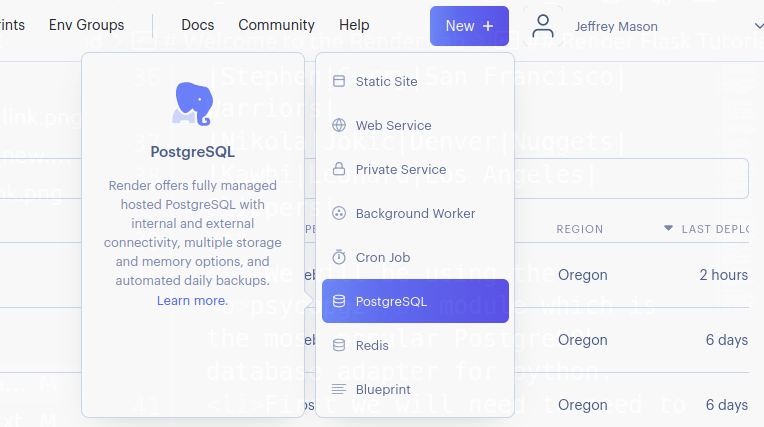
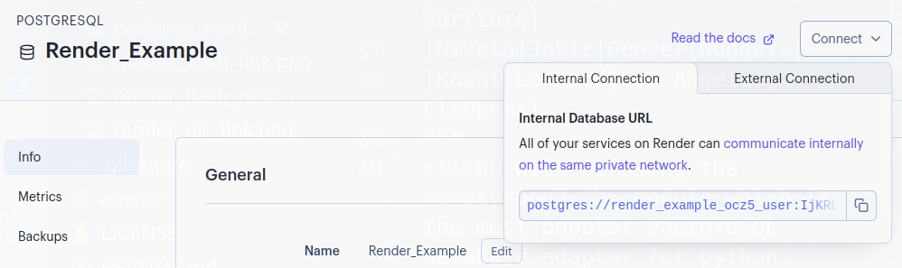
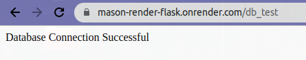

# Welcome to the Render Lab
The goal of this lab is to introduce the concept of bringing our flask apps onto the web.
To do so we'll use a site called "Render" which allows us to host websites, databases and much more at no cost. 
***
There are two parts to this lab
<li> Following the Render flask app tutorial to host a basic flask app on Render. </li>
<li> Spinning up a database using Render and creating routes that allow us to populate that database with information.

***
## Render Flask Tutorial
For this portion of the lab we will be following the Flask quickstart tutorial available on Render.
<li>All of the information that you will need can be found on this link https://render.com/docs/deploy-flask
but we will also walk through how to complete this portion step by step.
<br>
<li>To begin fork the repo located at https://github.com/render-examples/flask-hello-world
This contains the starting files needed to create a basic flask app.
<br>
<li>Next we need to create a new web service using Render.
From the quickstart tutorial page, you should see a link in the top right corner to the Dashboard.

<li>Once you've navigated to the render dashboard an icon to create a new service should appear up top. This will open a drop down with links to open a static site, web service, Postgres database and much more. For now we are going to create a <b>Web Service</b>.
<li>You'll be brought to a screen to enter the name the repository you forked.

<li>Next create a name for your web service on the next page, be sure that you've selected the free tier of services and you'll be good to go!
<li>Your flask app will be deployed to your_app_name.onrender.com 
<li>Whenever you push a change to your repo you'll have a version of your app automatically deployed to that render link.
<li>Note that deploying and reploying to render is not very fast, so whenever you make a change be sure to double check that your code is correct.
***
## Creating a Database on Render
<li> For the next portion of this lab our goal is to "spin up" an instance of a Postgres database, and create routes to populate it with data, query data, and delete data.
<li> You'll be spinning up a database on render and creating the following table. I'll provide all of the necessary SQL and you'll be creating the necessary routes to perform all of the functions needed.

|First|Last|City|Name|Number|
|---|---|---|---|---|
|Jayson|Tatum|Boston|Celtics|0|
|Stephen|Curry|San Francisco|Warriors|30|
|Nikola|Jokic|Denver|Nuggets|15|
|Kawhi|Leonard|Los Angeles|Clippers|2|
***
<li>We will be using the <b>psycopg2</b> module which is the most popular PostgreSQL database adapter for python.
<li>First we will need to need to make sure that we include the library in our requirements file, so include the following line to the requirements file

```
psycopg2-binary==2.9.5
```
<li>Next we need to spin up an instance of a Postgres database, fortunately for us Render allows us to do this for free.
<li>Similar to how we created a web service go to the dashboard in Render, select the new icon and this time choose PostgreSQL

<li>Now give your database a name and press create
<li>You'll be brought to a screen with information about the database you created and if you look under the connect tab you'll be given a url that'll link directly to your new database within other Render services

<li>Next we need to connect to this newly created database within our flask app.
<li>Within the app.py file of the quickstart flask app add the following line to the top of the file.

```
import psycopg2
```

<li> Next create a new route called db_test.
<li>Inside of that route we are going to connect to the database, do so by passing the internal database url to the following line

```
conn = psycopg2.connect("your_db_url_here")
```
<li>conn is now a variable that represents the connection to our database. Its important to remember to close the connection whenever we are done with it. So the last line of our route should be 

```
conn.close()
```
<li>Finally in this route we need to return something to show that our database connection is working properly. Return a string informing the user that the connection works properly.
<li>Push the changes to your repository to trigger a new deployment of your flask app. (Note : If at any point you aren't seeing the new version deploy navigate within the dashboard to your web service, select manual deploy and deploy the latest commit)
<li>Once the new build of your app has successfully deployed, navigate to the db_test route you just created and you should see your connection string returned.

***
<li>Great, we were able to successfully connect to our database, now I'm going to go over the basics of executing SQL statements using psycopg2 and then get into the list of routes you'll need to create along with the SQL for each route.
<li>Create a new route called db_create, here we will be creating a table titled Basketball. Begin this route similar to how we began the db_test route by connecting to our database.
<li>Next we are going to create a connection cursor that will allow us to execute SQL statements from inside of our route. Use the following code to create a cursor.

```
cur = conn.cursor()
```
<li>We now want that cursor to execute some SQL for us, namely the creation of our Basketball table. Call the execute method on our cursor and use triple quotes to allow multiple lines of SQL statements. (Be sure to end your statement with a semicolon).

```
cur.execute('''
    CREATE TABLE IF NOT EXISTS Basketball(
        First varchar(255),
        Last varchar(255),
        City varchar(255),
        Name varchar(255),
        Number int
        );
''')
```
<li>Next inside of that route we want to commit the changes from our cursor to our database, do so by using

```
conn.commit()
```
<li>Finally close the connection and then return a string to show that the table Basketball was successfully created.