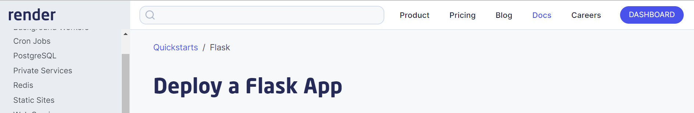
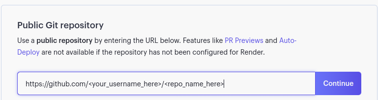

## Welcome to the Render Lab
The goal of this lab is to introduce the concept of bringing our flask apps onto the web.
To do so we'll use a site called "Render" which allows us to host websites, databases and much more. 
 
There are two parts to this lab
<li> Following the Render flask app tutorial to host a basic flask app on Render </li>
<li> Spinning up a database using Render and creating routes that allow us to populate that database with information

### Render Flask Tutorial
For this portion of the lab we will be following the Flask quickstart tutorial available on Render.
All of the information that you will need can be found on this link https://render.com/docs/deploy-flask
but we will also walk through how to complete this portion step by step.
 
To begin clone the repo located at https://github.com/render-examples/flask-hello-world
This contains the starting files needed to create a flask app.
 
Next we need to create a new web service using Render.
From the quickstart tutorial page, you should see a link in the top right corner to the Dashboard.

Once you've navigated to the render dashboard an icon to create a new service should appear up top. This will open a drop down with links to open a static site, web service, Postgres database and much more. For now we are going to create a <b>Web Service</b>
You'll be brought to a screen to enter the name the repository you forked to

Next create a name for your web service on the next page and you'll be good to go!